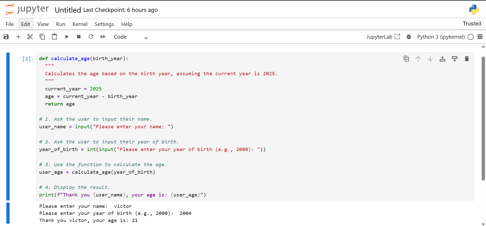
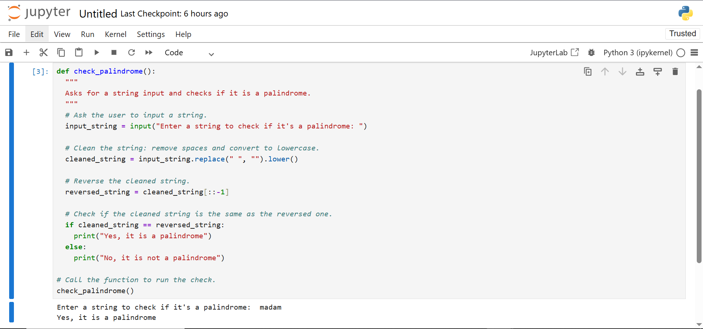
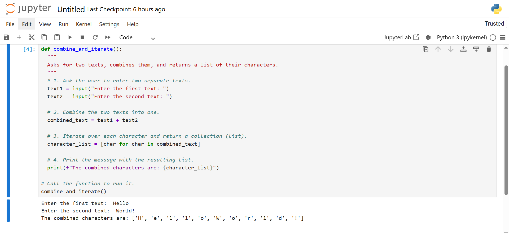

<a href="https://vscode.dev/github/DeNoella/intro-pythion-lab">
  
</a>

## 👥 GROUP MEMBERS

1. 26511  Jospin Nabonyimana
2. 26599  Mutesi Ange de Noella
3. 24251  Kambale Ngununu Daniel
4. 25230 Nsengiyumva Ngabo Cedric
5. 25918  INGABIRE NZARAMBA Ritha 25918
6. 27088  MUSHIMIRE Victor 


# 🚀 Question I: Age Calculator Using a Function 
This program will ask for your name and year of birth, then use a function to calculate your age as of 2025.

Method:


Get User Input: The program will first prompt the user to enter their name and then their year of birth. 

Define a Function: A function named calculate_age is defined. This function takes the birth_year as an argument.


Calculate Age: Inside the function, the age is calculated by subtracting the birth_year from the current year, which is specified as 2025. 

Display the Result: The function's result is then printed in the specified format, showing the user's name and their calculated age.

```PYTHON
def calculate_age(birth_year):
  """
  Calculates the age based on the birth year, assuming the current year is 2025.
  """
  current_year = 2025
  age = current_year - birth_year
  return age

# 1. Ask the user to input their name.
user_name = input("Please enter your name: ")

# 2. Ask the user to input their year of birth.
year_of_birth = int(input("Please enter your year of birth (e.g., 2000): "))

# 3. Use the function to calculate the age.
user_age = calculate_age(year_of_birth)

# 4. Display the result.
print(f"Thank you {user_name}, your age is: {user_age}")
```



# 🚀 Question II: Check Palindrome
This function checks if a word or phrase entered by the user is a palindrome (reads the same forwards and backwards).

Method:

Get User Input: The program asks the user for a string.

Clean the String: To accurately check for a palindrome, it's best to remove spaces and convert the string to a single case (e.g., lowercase). 

Reverse the String: The cleaned string is then reversed. A simple way to do this in Python is using slicing [::-1].

Compare Strings: The original cleaned string is compared to the reversed string. If they are identical, it's a palindrome.


Print the Result: The program prints "Yes, it is a palindrome" if it is, and "No, it is not a palindrome" otherwise. 

```PYTHON
def check_palindrome():
  """
  Asks for a string input and checks if it is a palindrome.
  """
  # Ask the user to input a string.
  input_string = input("Enter a string to check if it's a palindrome: ")

  # Clean the string: remove spaces and convert to lowercase.
  cleaned_string = input_string.replace(" ", "").lower()

  # Reverse the cleaned string.
  reversed_string = cleaned_string[::-1]

  # Check if the cleaned string is the same as the reversed one.
  if cleaned_string == reversed_string:
    print("Yes, it is a palindrome")
  else:
    print("No, it is not a palindrome")

# Call the function to run the check.
check_palindrome()
```



# 🚀 Question III: Iterating Over Two Text Inputs
This function takes two separate texts from the user, combines them, and then creates a list of every character in the combined text.

Method:


Get Two Inputs: The function will prompt the user to enter two separate texts. 


Combine Texts: The two input strings are concatenated (joined together) into a single string. 

Iterate and Collect Characters: The program then iterates through the combined string. Each character is added to a new list. A list comprehension [char for char in combined_text] is a concise way to achieve this.


Print the Result: Finally, the program prints the resulting list of characters. 

```PYTHON
def combine_and_iterate():
  """
  Asks for two texts, combines them, and returns a list of their characters.
  """
  # 1. Ask the user to enter two separate texts.
  text1 = input("Enter the first text: ")
  text2 = input("Enter the second text: ")

  # 2. Combine the two texts into one.
  combined_text = text1 + text2

  # 3. Iterate over each character and return a collection (list).
  character_list = [char for char in combined_text]

  # 4. Print the message with the resulting list.
  print(f"The combined characters are: {character_list}")

# Call the function to run it.
combine_and_iterate()
```


## 📝 License <a name="license"></a>

This project is [MIT](./LICENSE) licensed.

<p align="right">(<a href="#readme-top">back to top</a>)</p>
